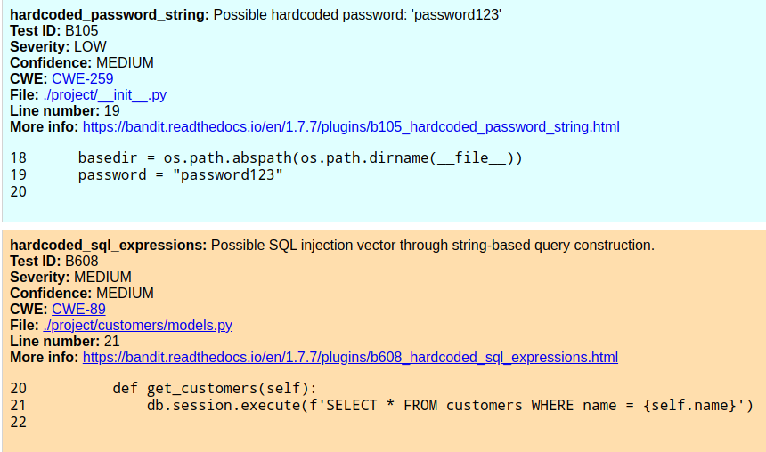

# Projekt procesu CICD

Zespół:
- Maciej Marcinkiewicz
- Krysztof Piotrowski
- Łukasz Pokorzyński

# Aplikacja

W procesie CICD wykorzystana została aplikacja napisana w języku Python wraz z frameworkiem Flask, którą mieliśmy okazję poznawać w ramach laboratorium na przedmiocie TBO.

# Opis zaimplementowanego procesu CICD

W ramach procesu CICD stworzone zostały 3 pliki o rozszerzeniu .yml:
- ci_lastest
- cd_latest
- ci_cd_beta

Dwie pierwsze konfiguracje dotyczą procesu CICD przeprowadzanego dla gałęzi master. Trzecia konfiguracja dotyczy procesu, który zachodzi na nowych gałęziach utworzonych przez użytkowników repozytorium.

## ci_latest
Plik konfiguracyjny może zostać uruchomiony przez operację utworzenia pull requesta w typach opened, reopened lub edited lub w sposób manualny dzięki tagowi *workflow_dispatch*.  
W ramach tego procesu stworzone zostały następujące joby:

### test-unit
Uruchamia testy jednostkowe. Kolejne kroki i ich nazwy:  
- Checkout
- Set up Python; wykorzystywana jest ostatnia wersja Python3
- Install dependencies; instaluje potrzebne wymagania zdefiniowane w pliku requirements.txt
- Test with PyTest; testy do tego kroku umieszczone zostały w folderze tests

### test-sast
Uruchamia testy SAST. Wykorzystywane jest oprogramowanie gitleaks oraz bandit.  
Kolejne kroki i ich nazwy:
- Checkout
- Run gitleaks
- Install bandit package
- Run bandit
- Upload bandit results; wyniki są zapisywane do artefaktu bandit-results.html

### test-dast
Uruchamia testy DAST. Wykorzystywane jest oprogramowanie ZAProxy. Proces ten ma udzieloną permisję *write-all*.  
Kolejne kroki i ich nazwy:
- Checkout
- Deploy with use of SSH; tworzy obraz Dockerowy z aktualnej gałęzi
- ZAP Scan

### test-sca
Uruchamia testy SCA. Wykorzystuje oprogramowanie Dependency-Check.  
Kolejne kroki i ich nazwy:
- Checkout
- Run dependency check
- Upload dependency check; zawsze zapisuje wyniki testu do folderu reports w Workspace

## cd-latest
Plik konfiguracyjny może zostać uruchomiony przez operację push do gałęzi master.  
W ramach tego procesu stworzone zostały jeden job o nazwie build.

### build
Buduje aplikację znajdującą się na gałęzi master.  
Kolejne kroki i ich nazwy:
- Checkout
- Login to Docker Hub
- Set up Docker Buildx
- Build and push; zbudowana aplikacja jest przekazywana z tagiem *latest*.

## ci_cd_beta
Plik konfiguracyjny może zostać uruchomiony przez operację push do każdej gałęzi oprócz master lub w sposób manualny dzięki tagowi *workflow_dispatch*.  
W ramach tego procesu stworzone zostały joby pokrywajace się w nazwach oraz podejmowanych krokach jak w procesach ci_latest oraz cd_latest opisanych wyżej.  
Zamiast tagu *latest* używany jest tag *beta* dla budowanych aplikacji. Poprawne zbudowanie aplikacji wymaga pomyślnego przejścia wszystkich jobów z testami jednostkowymi, SAST, DAST i SCA, co zostało ujęte w jobie **build** w polu *needs*.

# Wynik skanowania z użyciem procesu CICD
Na gałąź **dev** zostały dodane dwa commity zawierające po jednej podatności. Zostały
one wykryte podczas skanu SAST. Z racji że skany wykazywały inne błędy już przed 
dodaniem zmian zawierających podatności porównaliśmy raporty narzędziem **diff**
w celu wyszczególnienia jedynie nowych wyników skanowania wynikających z dodanych
na gałąź **dev** zmian:

```
83c83
<         Total lines of code: <span id="loc">725</span><br>
---
>         Total lines of code: <span id="loc">714</span><br>
102c102
<     <b>Line number: </b>15<br>
---
>     <b>Line number: </b>10<br>
107,155c107,109
< 14
< 15    app.config[&#x27;SECRET_KEY&#x27;] = &#x27;supersecret&#x27; # To allow us to use forms
< 16    app.config[&quot;TEMPLATES_AUTO_RELOAD&quot;] = True
< </pre>
< </div>
< 
< 
< </div>
< </div>
< 
< <div id="issue-1">
< <div class="issue-block issue-sev-low">
<     <b>hardcoded_password_string: </b> Possible hardcoded password: 'password123'<br>
<     <b>Test ID:</b> B105<br>
<     <b>Severity: </b>LOW<br>
<     <b>Confidence: </b>MEDIUM<br>
<     <b>CWE: </b><a href="https://cwe.mitre.org/data/definitions/259.html" target="_blank">CWE-259</a><br>
<     <b>File: </b><a href="./project/__init__.py" target="_blank">./project/__init__.py</a><br>
<     <b>Line number: </b>19<br>
<     <b>More info: </b><a href="https://bandit.readthedocs.io/en/1.7.7/plugins/b105_hardcoded_password_string.html" target="_blank">https://bandit.readthedocs.io/en/1.7.7/plugins/b105_hardcoded_password_string.html</a><br>
< 
< <div class="code">
< <pre>
< 18    basedir = os.path.abspath(os.path.dirname(__file__))
< 19    password = &quot;password123&quot;
< 20
< </pre>
< </div>
< 
< 
< </div>
< </div>
< 
< <div id="issue-2">
< <div class="issue-block issue-sev-medium">
<     <b>hardcoded_sql_expressions: </b> Possible SQL injection vector through string-based query construction.<br>
<     <b>Test ID:</b> B608<br>
<     <b>Severity: </b>MEDIUM<br>
<     <b>Confidence: </b>MEDIUM<br>
<     <b>CWE: </b><a href="https://cwe.mitre.org/data/definitions/89.html" target="_blank">CWE-89</a><br>
<     <b>File: </b><a href="./project/customers/models.py" target="_blank">./project/customers/models.py</a><br>
<     <b>Line number: </b>21<br>
<     <b>More info: </b><a href="https://bandit.readthedocs.io/en/1.7.7/plugins/b608_hardcoded_sql_expressions.html" target="_blank">https://bandit.readthedocs.io/en/1.7.7/plugins/b608_hardcoded_sql_expressions.html</a><br>
< 
< <div class="code">
< <pre>
< 20        def get_customers(self):
< 21            db.session.execute(f&#x27;SELECT * FROM customers WHERE name = {self.name}&#x27;)
< 22
---
> 9
> 10    app.config[&#x27;SECRET_KEY&#x27;] = &#x27;supersecret&#x27; # To allow us to use forms
> 11    app.config[&quot;TEMPLATES_AUTO_RELOAD&quot;] = True

```

Znalezione podatności w formie wyrenderowanego HTMLa wyglądają następująco:


